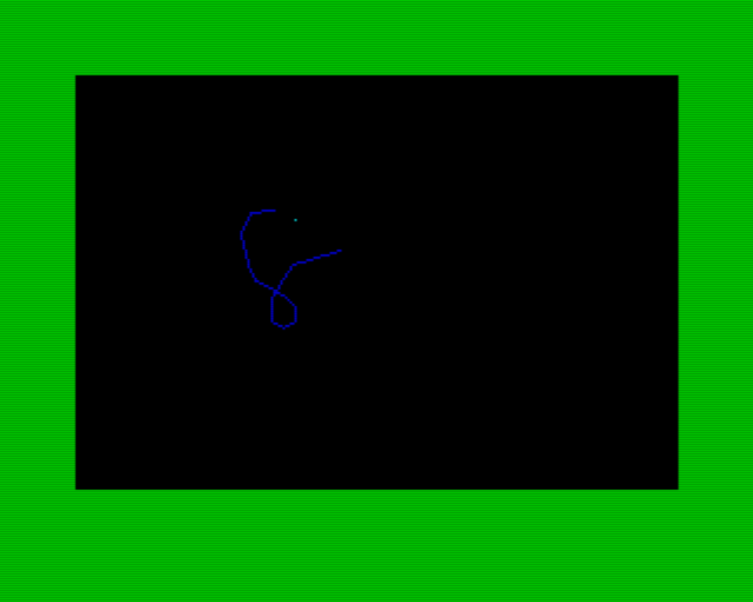
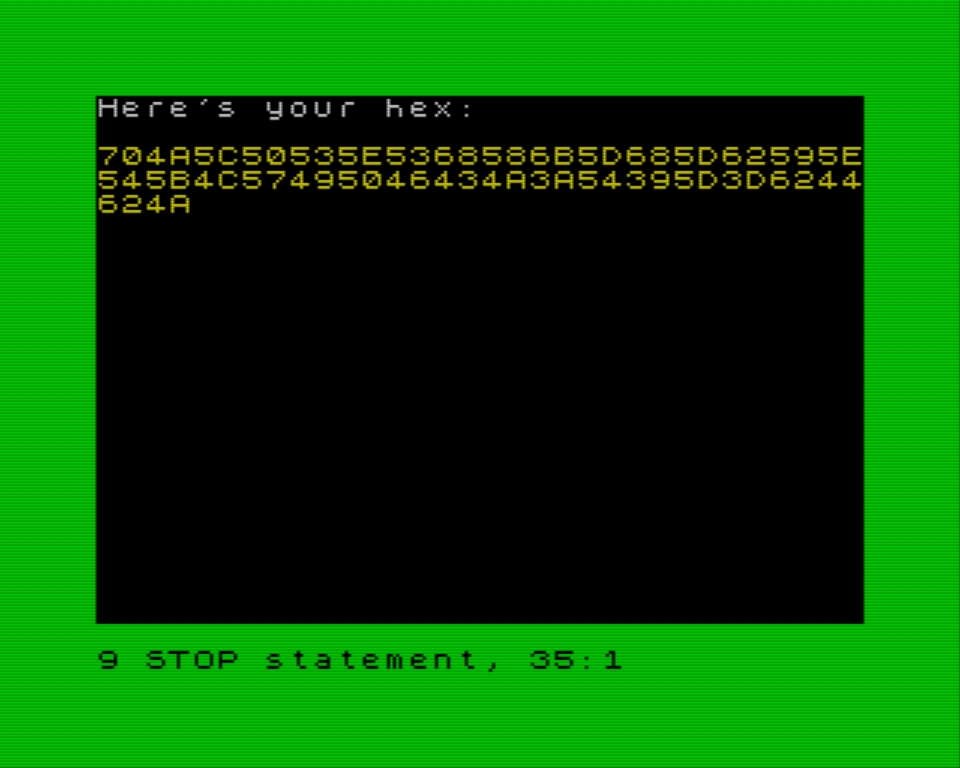
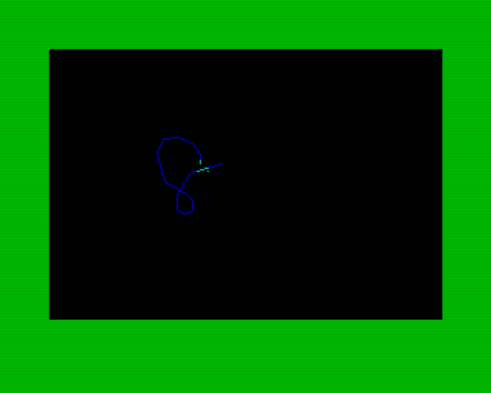
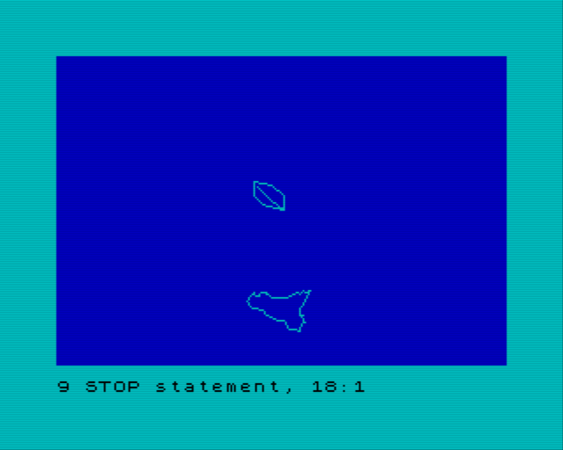

# PATHER

This is a ZX Spectrum tool for making simple line drawings. It produces hexadecimal strings that describe a sequence of line segments joined end-to-end and which can be drawn with a simple routine.

The drawing routine can be found in `template.bas`. Simply copy this file, replace the hex sequence with the one you've drawn, and it's ready to run.

## Usage

When run, Pather displays a cursor in teal. You can move this cursor around with the arrow keys.

When you press Space, the current location of the cursor is added to the path. The path is drawn in blue.



When you have finished your drawing, press Enter, and the generated hex sequence is displayed on the screen.



## Is it a bug?

When the cursor gets close to the path, part of the path gets highlighted too.



This is because the ZX Spectrum doesn't store colour information for every pixel on the screen. Colour is only stored for 8x8 blocks. So, if a given 8x8 block contains the teal cursor, then the entire 8x8 block turns teal. If you're a ZX Spectrum enthusiast, perhaps you already knew this. :-)

## Template program


> _template.bas initial state_

To create a program for your drawing from the template, take your hexadecimal string and write
code that assigns it to string variable `A$`:

```
1 LET a$="093309300B310B330C340F311233133418351A371D3720372435243329302C2D2E2D312D342C352938273A243B223E224422452448264B274C27502C5031523353355338533B553A563B583D5A3F5C425D445F4461456348664B694C694F6B4"
2 LET a$=a$+"F6D526E5371557356755578567B567C597E5C7F5C825D81608460855F8860896389668C678E698F699269936B937096739677967A977B967E937F958193849085908892899689978699859C829C7F9C7C9F7BA17BA47AA377A473A1719F709C6E9D"
3 LET a$=a$+"6B9D699D67A064A061A361A463A764AA64AD64AD67AE6AB16DB26BB269B466B163AE60AB5FAA5DA459A0589D5699559552954F974C964B934B904B8C4B8849844581447E427C3E7C3B7B37772E732D702A6D276A2669236922691D671A6A1A6A196"
4 LET a$=a$+"A1667136A0F6B0E6D0F6D11700E710C730C740B770B780C7A0B7B0E7A0F78117A137A167B187C1C7E197F1681158212841385158518861888168819891D8B208C228F238E248C268F2A902C932D952E9631963199319C319F33A335A637A73AA83B"
5 LET a$=a$+"A63AA63AA83DAB3DAE3EB141B542B745BA47BB48BC49BE4CC14CC24FC150C153C158BF59BF5CBF5FBE60BF63BE64BF66C269C569C66BC56DC870C973C975CC75CD77CF7AD078D37AD57BD27BCF7CCD7FCF7FD07ED27ED381D582D684D984DD84E18"
6 LET a$=a$+"4E382E684E885EA86ED86EB89E889E688E386E085DE84DC85D986D788D689D58BD68ED990DA93DA97DA9ADC9CDE9DDE9ADE97E099E19AE39DE3A0E4A0E69DE79CE89DEBA0EEA1EB9FEB9C"
```
> _Italy_

Insert this into a new file based on `template.bas` followed by `GO SUB 20`.

As shown in the template, you can also draw multiple paths by calling routine 20 more than once.
